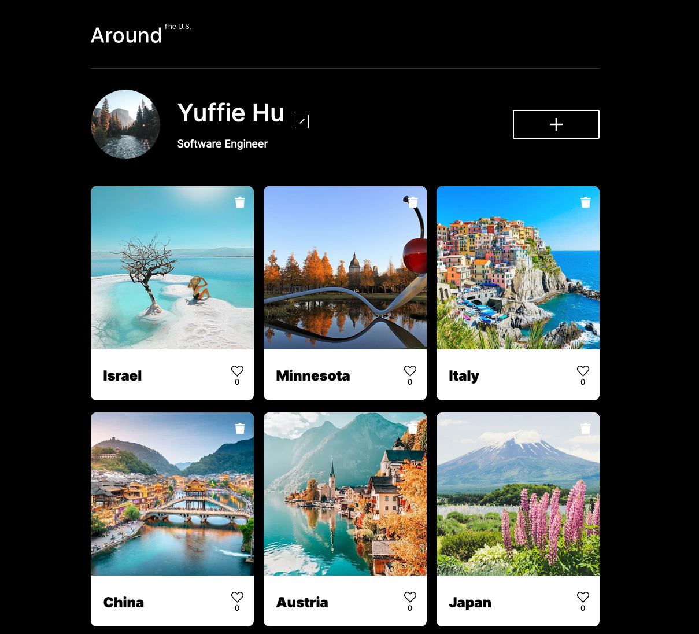

# Around the US -- Full Stack Web App

An Instagram-like app that displays user's pictures and places, with functionality to like, delete, and custimize.

## Live Demo

Enjoy the live demo [here](https://around-the-us.students.nomoredomainssbs.ru/).

## Features of the Web App

1. Modern and accessible UI built with React, including loading, form validation, and smooth transitions and animations
2. CRUD features with backend RESTful API to allow users to customize their profile and pictures
3. Social environment created through the "like" system among users
4. Responsive design with screen resolutions between 320px and 1280px
5. User authentication and authorization implemented with JSON Web Token, and Protected Routes with react-router-dom
6. Increased security with Helmet, CORS, password hashing, Winston Logging, dotenv, JOI/Celebrate validation

## Technologies and Standards Used

| 🔧         | 🖥                                                                                                                                                                                                                                                                                                                                                 |
| ---------- | ------------------------------------------------------------------------------------------------------------------------------------------------------------------------------------------------------------------------------------------------------------------------------------------------------------------------------------------------- |
| Frontend   |                                                                                                          |
| Backend    |    |
| Styling    |                                                                                                                                                                                                                                             |
| Deployment |        |

## Design

**Figma**

- [Link to the project in Figma](https://www.figma.com/file/SurN1jaeEQIhuZEDMhmWWf/Sprint-4-Around-The-U.S.-desktop-mobile?node-id=0%3A1)
